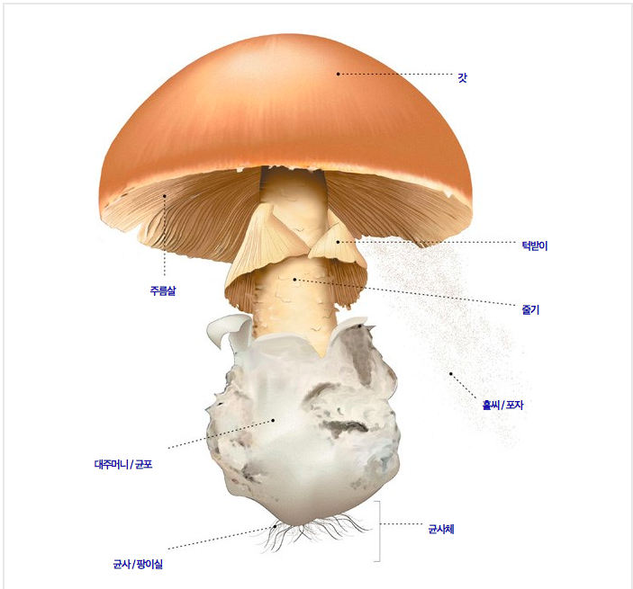

# Super Mario

- 데이터 출 처 : Kaggle  Dataset [https://www.kaggle.com/uciml/mushroom-classification](https://www.kaggle.com/uciml/mushroom-classification)
- 북아메리카 버섯에 대한 필드 안내서 (Audubon Society Field Guide from North American Mushrooms) (1981)에서 추출한 아가리쿠스 (Agaricus)와 레 피오 타 (Lepiota) 가족 버섯에 해당하는 가설 적 시료에 대한 설명이 포함되어 있습니다.
- 버섯 23 종의 데이터

### 변수 이름과 설명

|이름|설명|변수|
|------|------|------|
|class|식용 버섯과 독 버섯|p=poison, e=edible|
|cap-shape|갓 형태|bell=b, conical=c, convex=x, flat=f, knobbed=k, sunken=s|
|cap-surface|갓의 표면|fibrous=f, grooves=g, scaly=y, smooth=s|
|cap-color|갓의 색깔|brown=n, buff=b, cinnamon=c ,gray=g, green=r, pink=p, purple=u, red=e, white=w, yellow=y|
|bruises|멍 유무|bruises=t, no=f|
|odor|냄새|almond=a, anise=l, creosote=c, fishy=y, foul=f, musty=m, none=n, pungent=p, spicy=s
|gill-attachment|주름살|attached=a, descending=d, free=f, notched=n|
|gill-spacing|주름살 간격|close=c, crowded=w, distant=d|
|gill-size|주를살 크기|broad=b, narrow=n|
|gill-color|주름살 색|black=k, brown=n, buff=b, chocolate=h, gray=g,  green=r, orange=o, pink=p, purple=u, red=e, white=w, yellow=y|
|stalk-shape|줄기 모양|enlarging=e, tapering=t|
|stalk-root|줄기 뿌리|bulbous=b, club=c, cup=u, equal=e, rhizomorphs=z, rooted=r, missing=?|
|stalk-surface-above-ring|턱받이 위쪽 줄기 모양|fibrous=f, scaly=y, silky=k, smooth=s|
|stalk-surface-below-ring|턱받이 아래쪽 줄기 모양|fibrous=f, scaly=y, silky=k, smooth=s|
|stalk-color-above-ring|갓 위쪽의 줄기 색깔|brown=n, buff=b, cinnamon=c, gray=g, orange=o, pink=p ,red= , white=w, yellow=y|
|stalk-color-below-ring|갓 아래의 줄기 색깔|brown=n, buff=b, cinnamon=c, gray=g, orange=o, pink=p, red=e, white=w, yellow=y|
|veil-type|베일 유형|partial=p, universal=u|
|veil-color|베일 색깔|brown=n, orange=o, white=w, yellow=y|
|ring-number|턱받이 갯수|ring-number: none=n, one=o, two=t|
|ring-type|턱받이 유형|cobwebby=c, evanescent=e, flaring=f, large=l, none=n, pendant=p, sheathing=s, zone=z|
|spore-print-color|포자 색깔|black=k, brown=n, buff=b, chocolate=h, green=r, orange=o, purple=u, white=w, yellow=y|
|population|서식 분포 유형|abundant=a, clustered=c, numerous=n, scattered=s, several=v, solitary=y|
|habitat|서식지|grasses=g, leaves=l, meadows=m, paths=p, urban=u, waste=w, woods=d|

- 주름살 (gill) : 생식세포인 홀씨를 생성하는 버섯의 한 부분. 갓의 아랫면에 있다.

- 대주머니 / 균포 (volva): 미성숙한 버섯을 완전히 감싸고 있던 막이 줄기가 생장함에 따라 찢어진 흔적.

- 균사 / 팡이실 (hypha): 간혹 흰색을 띠는 미세한 사상체. 버섯의 생장에 필요한 물과 유기물질을 흡수한다.

- 균사체 (mycelium): 홀씨의 발아를 통해 생성된 균사가 서로 얽힌 집합체. 여기에서 버섯의 지상 부분이 발달한다.

- 홀씨 / 포자 (spores):  일반적으로 대기로 방출된 뒤 기질에 떨어져서 새로운 버섯이 생겨나게 하는 미세한 생식세포.

- 줄기 (stem): 버섯의 갓을 지지하는 기둥.

- 턱받이 (ring): 갓의 아래에서 줄기를 둘러싼 막. 미성숙한 버섯의 주름살을 감싸고 있다가 갓이 성장하면서 파열된 막의 흔적이다.

- 갓 (cap): 형태와 색상이 다양한 버섯의 상단부. 주름살을 보호한다. 대개 머리에 쓰는 모자를 닮은 형태를 띠는 데서 그 이름이 비롯되었다.

## 사용법
### Dependency Install
    $ python3 -m pip install -r requirements.txt
